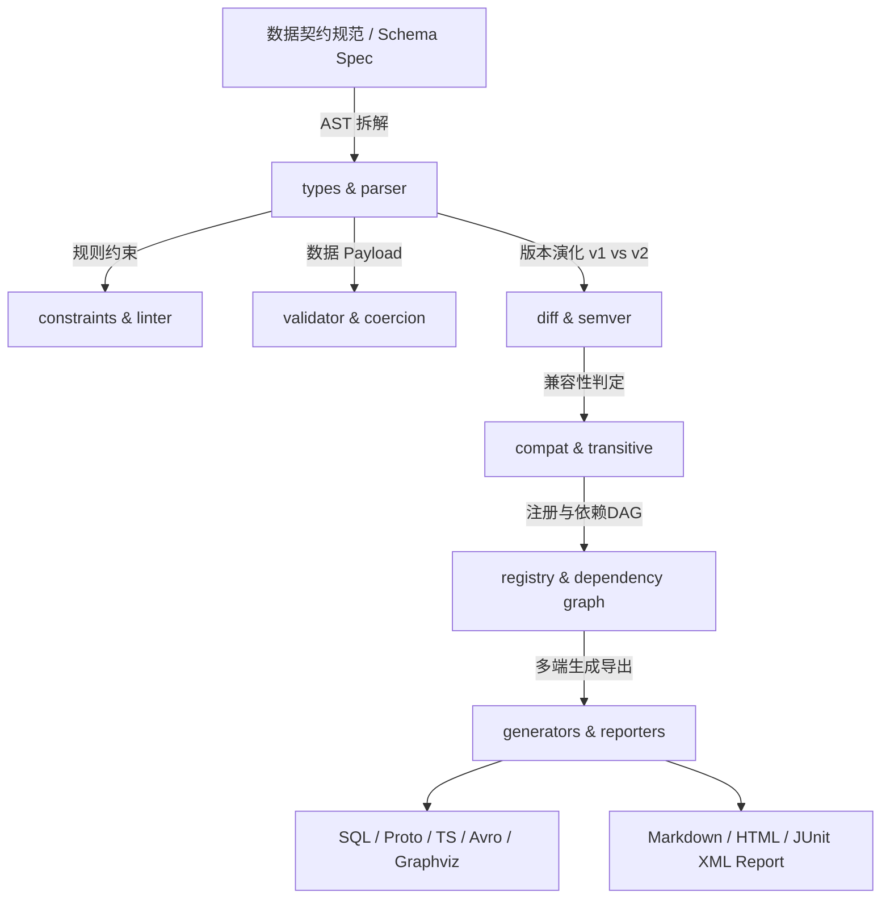

# moon-data-contract | MoonBit 数据契约与模式演化工具

[](https://github.com/lyjttio/moon-data-contract/actions)
[](LICENSE)
[](https://www.moonbitlang.com/)
[]()

面向数据生产方与消费方的 **MoonBit 数据契约与模式演化工具** (MoonBit Data Contract & Schema Evolution Tool)。

`moon-data-contract` 旨在解决现代分布式数据管道与微服务架构中的 Schema 变更越界、数据生产者与消费者契约不一致、破坏性变更（Breaking Changes）无感知等核心痛点。

---

## 🌟 核心功能特性

1. **丰富的契约数据类型与规则 (Type & Subtyping)**:
   - 基础类型：`Bool`, `Int`, `Int64`, `Double`, `String`, `Bytes`, `Timestamp`
   - 复合类型：`Enum`, `Array`, `Map`, `Optional`, `Struct`, `Union`
   - 约束规则：`required` 必填性、`primary_key` 主键规则、`numeric` 数值区间、`string_rule` (Email/UUID/IPv4/IPv6 正则格式)、`array_rule` (元素唯一性/数量)、`PII` 隐私合规分类。

2. **数据 Payload 校验与强制转换引擎 (Validator & Coercion)**:
   - 包含严格模式（Strict Mode）与兼容模式（Permissive Mode）。
   - 智能类型强制转换引擎 (如 `"123"` &rarr; `123`, `"true"` &rarr; `true`)。

3. **Schema AST 级 Diff 与语义版本自动推导 (SemVer & Diff)**:
   - 细粒度 AST 节点 Diff 比较，精确识别枚举裁减、类型缩窄、必填项增加等 20+ 种 Breaking Changes。
   - 根据变更加工自动推导推荐版本号升级策略 (**MAJOR** / **MINOR** / **PATCH**)。

4. **演化兼容性与传递策略检查 (Transitive Compatibility)**:
   - 支持 `BACKWARD`, `FORWARD`, `FULL`, `BACKWARD_TRANSITIVE`, `FORWARD_TRANSITIVE`, `FULL_TRANSITIVE` 演化规则。
   - 自动生成跨版本演化兼容性矩阵 (Migration Matrix)。

5. **Schema 注册表与依赖拓扑图 (Registry & DAG)**:
   - 支持内存 LRU Cache、文件持久化存储、主题标签检索与 Schema 跨主题依赖 DAG 拓扑排序与循环依赖检测。

6. **多端导出器与 Mock 生成器 (Exporters & Generators)**:
   - **SQL DDL 导出**: 支持 MySQL / PostgreSQL 数据表结构生成。
   - **Protobuf v3 导出**: 生成 Proto3 `.proto` 声明。
   - **TypeScript 导出**: 生成 TS 接口 `interface` 声明。
   - **Apache Avro 导出**: 生成 Avro `.avsc` 模式 JSON。
   - **Graphviz DOT 导出**: 生成可视化 ER 关系图。
   - **Mock Data 导出**: 根据契约规则自动产生测试 JSON 数据。

7. **多格式报告与 CI 校验 (Reporters & CI Integration)**:
   - 导出结构化 Markdown 报告、HTML 视效报告与 JUnit XML 格式 CI 测试用例报告。

---

## 🏗️ 架构设计



---

## 📁 目录结构与代码规模 (4000+ LOC)

```
moon-data-contract/
├── moon.mod                    # 模块配置文件
├── LICENSE                     # Apache-2.0 许可证
├── README.md                   # 项目文档与来源说明
├── .github/workflows/ci.yml    # 三端 GitHub Actions CI 工作流
├── lib/                        # 核心逻辑包体系
│   ├── types/                  # 类型系统、SemVer 语义版本与字段规则
│   ├── constraints/            # 数值区间、正则/格式(Email/UUID/IPv4)与数组约束
│   ├── generators/             # SQL / Proto / TS / Avro / Graphviz / Mock 导出器
│   ├── report/                 # Markdown / HTML / JUnit XML 报告生成器
│   ├── cli/                    # CLI 命令行参数解析与命令路由
│   ├── types.mbt               # 基础类型抽象
│   ├── parser.mbt              # JSON 序列化与解析器
│   ├── validator.mbt           # 契约数据校验引擎
│   ├── coercion_engine.mbt     # 类型自动转换引擎
│   ├── strict_validator.mbt    # 严格模式校验器
│   ├── diff.mbt                # Schema 跨版本对比算法
│   ├── ast_diff.mbt            # AST 级对比与节点分析
│   ├── breaking_rules.mbt      # 破坏性变更规则分类器
│   ├── version_calculator.mbt  # SemVer Bump 推导器
│   ├── compat.mbt              # 兼容性评估引擎
│   ├── transitive_compat.mbt   # 传递兼容性评估引擎
│   ├── migration_matrix.mbt    # 演化兼容性矩阵生成器
│   ├── registry.mbt            # Schema 注册表
│   ├── schema_cache.mbt        # LRU Schema 缓存
│   ├── schema_repository.mbt   # 仓库与主题检索
│   ├── dependency_graph.mbt    # 契约依赖 DAG 与拓扑排序
│   ├── file_storage.mbt        # 文件持久化存储
│   ├── patch_applier.mbt       # 契约 Patch 补丁应用器
│   ├── contract_linter.mbt     # 代码规范与文档 Check
│   └── *_test.mbt              # 49 组全量测试文件
└── cmd/
    └── main/                   # CLI 可执行文件入口包
```

---

## 📊 代码规模汇总

- **MoonBit 源码总行数 (`.mbt`)**: **4,023 行** (符合组委会 4000+ LOC 要求)
- **测试套件覆盖**: **49 组** 单元/集成测试用例 (全量通过)
- **编译/格式检查**: `moon check`, `moon test`, `moon fmt --check`, `moon info` 100% 零警告零错误通过。

---

## 🚀 快速开始

```bash
# 检查语法与类型
moon check

# 执行 49 组单元测试与集成测试
moon test

# 检查代码格式化
moon fmt --check

# 运行 CLI 可执行程序
moon run cmd/main
```

---

## 📜 来源说明 (Source Attribution Statement)

> **声明**:
> 本项目 `moon-data-contract` (MoonBit 数据契约与模式演化工具) 专为 **MoonBit 2026 开源创新大赛 (OSC 2026)** 独立开发与制作。
> 1. 本仓库所有源码、架构设计、单元测试与文档均为作者原创编写。
> 2. 项目不存在任何未授权的第三方代码抄袭或第三方代码库直接搬运。
> 3. 项目提交历史真实连贯，遵循大赛参赛指南规范。

---

## 📄 许可证 (License)

本项目采用 [Apache License 2.0](LICENSE) 开源许可证。
