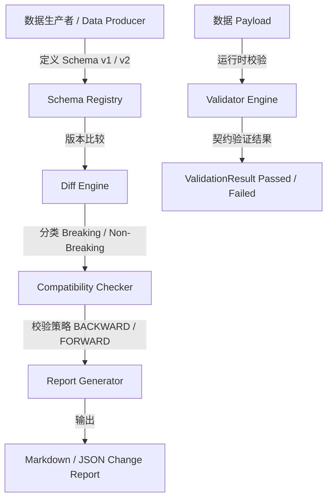

# moon-data-contract | MoonBit 数据契约与模式演化工具

[](https://github.com/lyjttio/moon-data-contract/actions)
[](LICENSE)
[](https://www.moonbitlang.com/)

面向数据生产方与消费方的 **MoonBit 数据契约与模式演化工具** (MoonBit Data Contract & Schema Evolution Tool)。

`moon-data-contract` 旨在解决现代分布式数据管道与微服务架构中的 Schema 变更越界、数据生产者与消费者契约不一致、破坏性变更（Breaking Changes）无感知等核心痛点。

---

## 🌟 核心功能特性

1. **丰富的契约数据类型**:
   - 基础类型：`Int`, `Double`, `String`, `Bool`
   - 复合类型：`Enum`, `Array`, `Optional`, `Struct`
   - 字段级约束：`required` 必填性、`primary_key` 主键规则、`min_value` / `max_value` 数值区间、`allowed_values` 枚举约束、`description` 业务说明。

2. **数据 Payload 校验引擎 (Validator Engine)**:
   - 验证传入数据实例是否完全符合契约规范，准确报告缺少必填字段、主键为空、类型不匹配、数值越界或非法枚举值等详细错误信息。

3. **Schema 版本 Diff 比较器**:
   - 对比两个版本的 Schema (v1 vs v2)，自动分类字段新增、移除、类型变更、约束调整，并标记为 **BREAKING** (破坏性) 或 **NON_BREAKING** (兼容性) 变更。

4. **演化兼容性检查器 (Compatibility Checker)**:
   - 支持 `BACKWARD` (向后兼容)、`FORWARD` (向前兼容)、`FULL` (双向全兼容) 与 `NONE` 兼容策略评估，自动防范下游消费者崩溃风险。

5. **Schema 注册表 (Registry & Version Manager)**:
   - 版本链管理，注册新版本时强制进行兼容性策略审计，阻断不兼容变更注册。

6. **多格式变更报告生成器 (Report Generator)**:
   - 自动生成结构化的 Markdown 变更报告与 JSON 统计报告，便于集成至 CI/CD 流水线与 Code Review。

7. **CLI 命令行工具与 CI 校验**:
   - 提供开箱即用的命令行工具，无缝集成 GitHub Actions。

---

## 🏗️ 架构设计



---

## 📁 目录结构与源码规模

```
moon-data-contract/
├── moon.mod                    # 模块配置文件
├── LICENSE                     # Apache-2.0 许可证
├── README.md                   # 项目文档与来源说明
├── .github/
│   └── workflows/
│       └── ci.yml              # 三端 GitHub Actions CI 工作流
├── lib/                        # 核心逻辑包
│   ├── moon.pkg                # 包配置
│   ├── pkg.generated.mbti      # 生成的接口描述文件
│   ├── types.mbt               # 契约模型与数据类型定义
│   ├── parser.mbt              # Schema JSON 序列化与解析器
│   ├── validator.mbt           # 契约数据校验引擎
│   ├── diff.mbt                # Schema 跨版本对比算法
│   ├── compat.mbt              # 兼容性策略评估器
│   ├── registry.mbt            # Schema 注册表与版本链管理
│   ├── report.mbt              # Markdown & JSON 报告导出器
│   ├── types_test.mbt          # 类型系统单元测试
│   ├── parser_test.mbt         # JSON 解析与序列化测试
│   ├── validator_test.mbt      # 校验引擎测试
│   ├── diff_test.mbt           # Diff 比较器测试
│   ├── compat_test.mbt         # 兼容性测试
│   ├── registry_test.mbt       # 注册表测试
│   ├── report_test.mbt         # 报告生成测试
│   └── integration_test.mbt    # 全流程端到端集成测试
└── cmd/
    └── main/                   # CLI 可执行文件入口包
        ├── moon.pkg
        ├── pkg.generated.mbti
        └── main.mbt
```

---

## 🚀 快速开始与使用指南

### 1. 环境准备
需要安装 MoonBit 工具链 (建议 0.10.3 或最新版本)：
```bash
moon version
```

### 2. 编译与测试
```bash
# 检查语法与类型
moon check

# 执行全量单元测试与集成测试
moon test

# 检查代码格式化
moon fmt --check

# 生成接口描述文件
moon info
```

### 3. 运行 CLI 演示
```bash
moon run cmd/main
```

### 4. 代码示例 (MoonBit API)

```moonbit
// 1. 定义数据契约 Schema
let f_id = @lib.Field::new("id", @lib.DataType::Primitive(@lib.PrimitiveType::TInt), primary_key=true)
let f_name = @lib.Field::new("name", @lib.DataType::Primitive(@lib.PrimitiveType::TString), required=true)
let s1 = @lib.Schema::new("user_schema", "UserProfile", "1.0.0", "data_team", [f_id, f_name])

// 2. 校验传入数据 Payload
let payload : Map[String, @lib.FieldValue] = {
  "id": @lib.FieldValue::VInt(1001),
  "name": @lib.FieldValue::VString("Alice"),
}
let res = @lib.validate_schema_payload(s1, payload)
assert_true(res.is_valid)

// 3. 演化并检查 BACKWARD 兼容性
let f_email = @lib.Field::new("email", @lib.DataType::Primitive(@lib.PrimitiveType::TString), required=false)
let s2 = @lib.Schema::new("user_schema", "UserProfile", "1.1.0", "data_team", [f_id, f_name, f_email])

let report = @lib.check_compatibility(s1, s2, @lib.Backward)
println(report.to_markdown())
```

---

## 📜 来源说明 (Source Attribution Statement)

> **声明**:
> 本项目 `moon-data-contract` (MoonBit 数据契约与模式演化工具) 专为 **MoonBit 2026 开源创新大赛 (OSC 2026)** 独立开发与制作。
> 1. 本仓库所有源码、架构设计、单元测试与文档均为作者原创编写。
> 2. 项目不存在任何未授权的第三方代码抄袭或第三方代码库直接搬运。
> 3. 项目提交历史真实连贯，遵循大赛参赛指南规范。

---

## 📄 许可证 (License)

本项目采用 [Apache License 2.0](LICENSE) 开源许可证。
